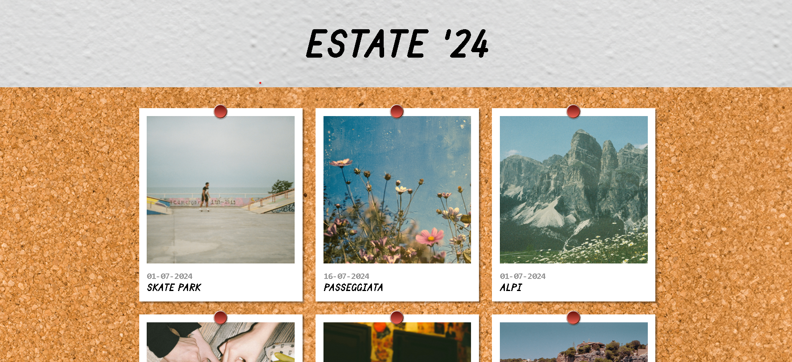

# 📸 Photo Blog – *Estate ’24*

> Una **bacheca fotografica interattiva** in stile vintage che richiama una vera **bacheca di sughero** con foto Polaroid.
>
> Progetto realizzato per esplorare **JavaScript Vanilla**, la **manipolazione del DOM** e l’integrazione di **API esterne**.

---

## 🚀 Panoramica

**Photo Blog – Estate ’24** carica dinamicamente immagini e metadati da un’API esterna tramite **Axios**.
Ogni foto viene renderizzata come una **Polaroid interattiva**, completa di animazioni realistiche e visualizzazione a schermo intero tramite un elegante sistema di **overlay/modale**.

📌 L’obiettivo principale è unire **funzionalità tecniche** e **cura estetica**, ricreando un’esperienza visiva immersiva e nostalgica.

---

## 🛠️ Stack Tecnologico

* **Linguaggi**: HTML5, CSS3, JavaScript (ES6+)
* **Librerie**: Axios (gestione chiamate HTTP)
* **Design & Layout**:

  * CSS Custom Properties
  * Flexbox
  * CSS Transitions & Transforms

---

## ✨ Caratteristiche Principali

* **Popolamento Dinamico**                       
  Recupero asincrono dei dati (titoli, date, URL immagini) e rendering automatico delle card nel DOM.

* **Effetti Hover Realistici**               
  Animazioni CSS che simulano il sollevamento delle Polaroid dalla bacheca, con leggere rotazioni e ombre dinamiche.

* **Sistema di Overlay**                 
  Visualizzazione delle immagini in formato ingrandito tramite una modale personalizzata per un’esperienza utente fluida e coinvolgente.

* **Design Responsivo**                      
  Layout ottimizzato per **Desktop, Tablet e Mobile**, mantenendo l’estetica della bacheca su ogni risoluzione.

---

## 💡 Sfide Tecniche & Apprendimenti

* **Gestione API**              
  Utilizzo di Axios per il flusso asincrono dei dati, garantendo il rendering dell’interfaccia solo dopo il completamento delle richieste.

* **UI / UX**                     
  Realizzazione di un’interfaccia che richiama una bacheca reale, curando dettagli come:

  * pin rossi
  * texture del sughero

* **Logica DOM & Performance**                            
  Gestione efficiente degli event listener per apertura/chiusura dell’overlay.

---

## 🔧 Installazione

Clona la repository:

```bash
git clone https://github.com/giorgiameffe/js-photo-blog.git
```

Entra nella cartella del progetto:

```bash
cd js-photo-blog
```

Apri `index.html` nel browser oppure utilizza **Live Server** su VS Code.

---

## 🖼️ Screenshot

